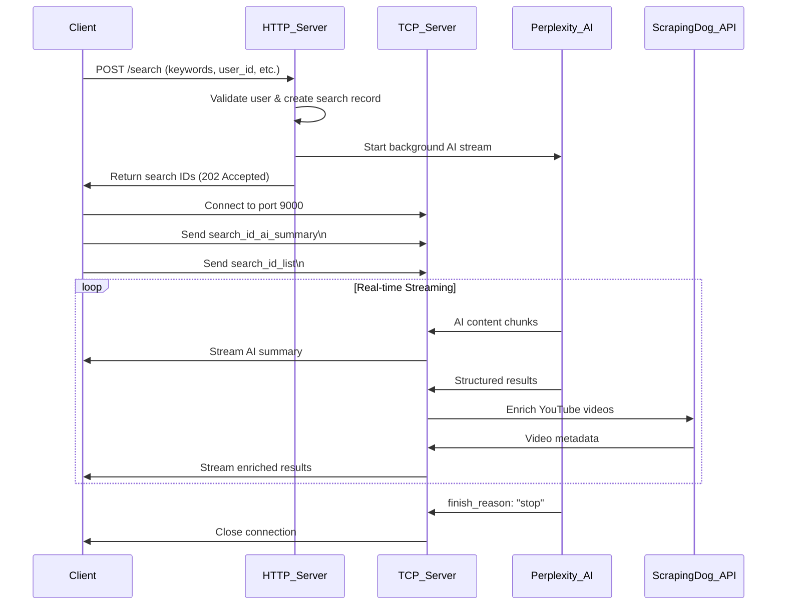

# BlinkAI Search Engine API Documentation

## Overview
The BlinkAI Search Engine provides real-time AI-powered search capabilities with streaming responses. The API processes search queries through Perplexity AI and returns enriched results including web content, images, videos, and related questions.

## Base URL
```
http://209.145.62.140:8080
```

## Authentication
Currently no authentication required. All requests are processed based on user identification.

---

## Search Endpoint

### POST `/search`

Initiates a search request and returns immediate acknowledgment. Real-time results are streamed via TCP socket connection.

#### Request Headers
```
Content-Type: application/json
```

#### Request Body
```json
{
  "keywords": ["string"],
  "user_id": "string",
  "device_id": "string", 
  "platform_name": "string",
  "search_type": "string"
}
```

#### Request Parameters

| Parameter | Type | Required | Description |
|-----------|------|----------|-------------|
| `keywords` | `string[]` | ✅ | Array of search keywords. Can be 1-3 keywords. Supports contextual search flow |
| `user_id` | `string` | ✅ | Unique user identifier (UUID format) |
| `device_id` | `string` | ✅ | Unique device identifier (UUID format) |
| `platform_name` | `string` | ✅ | Platform name (e.g., "ios", "android", "web") |
| `search_type` | `string` | ✅ | Type of search: `"all"` or `"video"` |

#### Keywords Behavior

**Single Keyword:**
```json
{
  "keywords": ["artificial intelligence"]
}
```
- Creates focused search with single topic
- Faster processing
- More targeted results

**Multiple Keywords (Contextual Search):**
```json
{
  "keywords": ["machine learning", "ai summary", "deep learning"]
}
```
- **First keyword**: Your initial search query
- **Second keyword**: AI-generated summary/context from previous search
- **Third keyword**: Follow-up question based on the AI context
- Creates contextual, progressive search that builds on AI insights
- More intelligent and relevant results
- Enables conversational search flow
- Slightly longer processing time due to context analysis

#### Search Types

**`"all"` Search Type:**
- Returns web results, images, and videos
- Uses `sonar-pro` model with temperature 0.1
- Max 10 search results
- Includes YouTube domain filtering
- Returns related questions

**`"video"` Search Type:**
- Optimized for video content
- Uses `sonar-pro` model with temperature 0.2
- Focuses on YouTube results
- Returns related questions
- Better for video discovery

#### User Management

**New User Creation:**
- If `user_id` doesn't exist, a new user is automatically created
- User record includes: `user_id`, `device_id`, `platform_name`, `created_at`
- No additional setup required

**Existing User:**
- If `user_id` exists, user data is retrieved
- Device and platform info may be updated
- Search history is maintained

#### Response Format

**Success Response (HTTP 202 Accepted):**
```json
{
  "success": true,
  "message": "Your request is being processed",
  "user_id": "550e8400-e29b-41d4-a716-446655440000",
  "search_type": "all",
  "keywords": ["artificial intelligence"],
  "timestamp": "2025-01-10T15:30:45Z",
  "search_id_ai_summary": "search-uuid_ai_summary",
  "search_id_list": "search-uuid_list",
  "system_prompt_id": "prompt-uuid"
}
```

**Error Responses:**

*Validation Error (HTTP 400):*
```json
{
  "success": false,
  "message": "Validation failed",
  "error": "keywords field is required"
}
```

*User Creation Error (HTTP 500):*
```json
{
  "success": false,
  "message": "Failed to validate/create user",
  "error": "Database connection failed"
}
```

*Timeout Error (HTTP 408):*
```json
{
  "success": false,
  "message": "User validation timeout - please try again",
  "error": "Database operation timed out"
}
```

#### Response Fields Explained

| Field | Description |
|-------|-------------|
| `search_id_ai_summary` | ID for AI-generated summary stream |
| `search_id_list` | ID for enriched results list stream |
| `system_prompt_id` | ID of the system prompt used for this search type |

---

## Real-Time Streaming

### TCP Socket Connection

After receiving the HTTP response, connect to the TCP socket to receive real-time results.

#### Connection Details
- **Host:** Same as HTTP server IP
- **Port:** `9000`
- **Protocol:** TCP
- **Registration:** Send `search_id_ai_summary` or `search_id_list` followed by newline

#### Stream Types

**AI Summary Stream (`search_id_ai_summary`):**
- Real-time AI-generated content chunks
- Continuous text stream from Perplexity AI
- Ends when `finish_reason: "stop"` is received

**Results List Stream (`search_id_list`):**
- Structured JSON objects for each result
- Includes web results, images, videos, and related questions
- YouTube videos are enriched with metadata via ScrapingDog API

#### Stream Data Format

**AI Summary Chunks:**
```
{"object":"content","content_chunk":"This is a chunk of AI-generated text..."}
{"object":"content","content_chunk":"Continuing the response..."}
{"object":"done","finish_reason":"stop"}
```

**Results List Items:**
```json
{
  "seq_no": 1,
  "is_citation": true,
  "kind": "web",
  "payload": {
    "title": "Article Title",
    "url": "https://example.com",
    "snippet": "Article preview...",
    "source": "Example.com"
  }
}
```

**Video Items (Enriched):**
```json
{
  "seq_no": 2,
  "is_citation": true,
  "kind": "video",
  "payload": {
    "video_id": "dQw4w9WgXcQ",
    "url": "https://www.youtube.com/watch?v=dQw4w9WgXcQ",
    "title": "Video Title",
    "thumbnail_url": "https://i.ytimg.com/vi/dQw4w9WgXcQ/maxresdefault.jpg",
    "thumbnail_width": 1280,
    "thumbnail_height": 720,
    "publish_date": "2023-01-15",
    "likes": 1200000,
    "views": 329067736,
    "description": "Video description..."
  }
}
```

**Related Questions:**
```json
{
  "seq_no": 10,
  "is_citation": false,
  "kind": "related",
  "payload": {
    "queries": [
      "What is machine learning?",
      "How do neural networks work?",
      "Applications of deep learning"
    ]
  }
}
```

---

## Error Handling

### Common Error Scenarios

1. **Invalid User ID Format**
   - User ID must be valid UUID format
   - Returns HTTP 500 with error details

2. **Database Connection Issues**
   - Temporary database unavailability
   - Returns HTTP 500 with timeout message

3. **Missing Required Fields**
   - Any required field missing or empty
   - Returns HTTP 400 with validation error

4. **Invalid Search Type**
   - Must be "all" or "video"
   - Returns HTTP 400 with validation error

5. **TCP Connection Issues**
   - Socket connection failures
   - Client should retry connection
   - Server logs connection attempts

### Rate Limiting

- No explicit rate limiting implemented
- ScrapingDog API has rate limits (429 errors logged)
- Perplexity AI has usage limits

---

## Example Usage

### Complete Flow Example

1. **Send HTTP Request:**
```bash
curl -X POST http://209.145.62.140:8080/search \
  -H "Content-Type: application/json" \
  -d '{
    "keywords": ["artificial intelligence", "AI is transforming industries through automation", "machine learning applications"],
    "user_id": "550e8400-e29b-41d4-a716-446655440000",
    "device_id": "123e4567-e89b-12d3-a456-426614174000",
    "platform_name": "ios",
    "search_type": "all"
  }'
```

2. **Connect to TCP Socket:**
```python
import socket

# Connect to socket
sock = socket.socket(socket.AF_INET, socket.SOCK_STREAM)
sock.connect(('209.145.62.140', 9000))

# Register for AI summary stream
search_id = "search-uuid_ai_summary"
sock.send(f"{search_id}\n".encode())

# Receive chunks
while True:
    data = sock.recv(1024)
    if not data:
        break
    print(data.decode())
```

3. **Process Streamed Data:**
- Parse JSON chunks as they arrive
- Handle different object types (content, done)
- Process structured results (web, video, image, related)
- Display enriched video metadata

---

## System Requirements

### Server Requirements
- Go 1.21+
- PostgreSQL database
- Perplexity AI API key
- ScrapingDog API key (for video enrichment)

### Client Requirements
- HTTP client for initial request
- TCP socket client for streaming
- JSON parsing capabilities
- Network connectivity to server

---

## Performance Notes

- HTTP response typically returns within 100-500ms
- AI streaming begins within 1-2 seconds
- Video enrichment happens asynchronously
- Total processing time: 30-90 seconds depending on query complexity
- Concurrent searches supported (each gets unique search IDs)

---

## Request Flow & Platform Implementation

### Complete Request Flow

The BlinkAI Search API follows a **two-phase communication pattern**:

1. **Phase 1: HTTP Request** - Initiate search and get search IDs
2. **Phase 2: TCP Streaming** - Connect to real-time data streams

### Step-by-Step Flow



### Python Implementation

```python
import socket
import threading
import requests
import json
import time

HOST_HTTP = "http://209.145.62.140:8080"
HOST_TCP = "209.145.62.140"
PORT_TCP = 9000

def recv_loop(sock: socket.socket, label: str):
    """Receive chunks from a single socket and label them."""
    try:
        while True:
            data = sock.recv(8192)
            if not data:
                print(f"✅ [{label}] Connection closed by server")
                break
            print(f"📥 [{label}] Received chunk:", data.decode("utf-8", errors="replace"), end="")
    except Exception as e:
        print(f"❌ [{label}] Error receiving data:", e)

def connect_and_listen(search_id: str, label: str):
    """Connects to TCP socket, sends search_id, and starts receiving."""
    sock = socket.socket(socket.AF_INET, socket.SOCK_STREAM)
    try:
        sock.connect((HOST_TCP, PORT_TCP))
        print(f"✅ [{label}] Connected to {HOST_TCP}:{PORT_TCP}")
    except Exception as e:
        print(f"❌ [{label}] TCP connect failed:", e)
        return

    # Start thread for receiving data
    t = threading.Thread(target=recv_loop, args=(sock, label), daemon=True)
    t.start()

    # Send search ID line to register
    try:
        line = (search_id + "\n").encode("utf-8")
        sock.sendall(line)
        print(f"📤 [{label}] Sent search_id line")
    except Exception as e:
        print(f"❌ [{label}] Failed to send search_id:", e)
        sock.close()
        return

    # Keep main thread alive while receiver runs
    try:
        while t.is_alive():
            time.sleep(0.25)
    finally:
        try:
            sock.shutdown(socket.SHUT_RDWR)
        except Exception:
            pass
        sock.close()
        print(f"🔚 [{label}] Socket closed.")

def main():
    # 1) POST /search to get both search IDs
    payload = {
        "keywords": ["artificial intelligence", "AI is transforming industries", "machine learning applications"],
        "user_id": "536947fd-3ddf-4cf5-812e-6c057bf4267c",
        "device_id": "4f66cab3-4c0f-41a6-b5a2-2d96521af592",
        "platform_name": "python",
        "search_type": "all"
    }

    url = f"{HOST_HTTP}/search"
    print("🌐 Sending API request to", url)
    try:
        r = requests.post(url, json=payload, timeout=30)
    except Exception as e:
        print("❌ HTTP error:", e)
        return

    print("HTTP", r.status_code)
    print("Body:", r.text)

    if r.status_code not in (200, 202):
        print("❌ Unexpected status code")
        return

    try:
        data = r.json()
    except Exception as e:
        print("❌ JSON parse error:", e)
        return

    if not data.get("success"):
        print("❌ API did not succeed:", json.dumps(data, indent=2))
        return

    # Extract both IDs
    search_id_summary = data.get("search_id_ai_summary")
    search_id_list = data.get("search_id_list")

    if not search_id_summary or not search_id_list:
        print("❌ Missing search IDs in response")
        print(json.dumps(data, indent=2))
        return

    print("✅ Got search IDs:")
    print("   🧠 AI Summary:", search_id_summary)
    print("   📺 List:", search_id_list)

    # 2) Start both TCP connections in parallel
    t1 = threading.Thread(target=connect_and_listen, args=(search_id_summary, "AI_SUMMARY"), daemon=True)
    t2 = threading.Thread(target=connect_and_listen, args=(search_id_list, "SEARCH_LIST"), daemon=True)

    t1.start()
    t2.start()

    # Keep main alive while both threads are active
    try:
        while t1.is_alive() or t2.is_alive():
            time.sleep(0.5)
    except KeyboardInterrupt:
        print("\n🛑 Interrupted by user, closing sockets...")

if __name__ == "__main__":
    main()
```

### How the Python Code Works

#### **Step-by-Step Flow Explanation:**

**1. HTTP Request Phase:**
```python
# Send POST request to /search endpoint
r = requests.post(url, json=payload, timeout=30)
```
- Sends your search keywords, user info, and search type to the server
- Server validates user, creates search record, and starts Perplexity AI stream
- Returns two unique search IDs: `search_id_ai_summary` and `search_id_list`

**2. TCP Connection Setup:**
```python
# Create two parallel threads for both streams
t1 = threading.Thread(target=connect_and_listen, args=(search_id_summary, "AI_SUMMARY"), daemon=True)
t2 = threading.Thread(target=connect_and_listen, args=(search_id_list, "SEARCH_LIST"), daemon=True)
```
- Creates separate threads for each stream type
- `AI_SUMMARY` thread receives real-time AI-generated text chunks
- `SEARCH_LIST` thread receives structured results (web, images, videos, related questions)

**3. Socket Connection Process:**
```python
sock.connect((HOST_TCP, PORT_TCP))  # Connect to port 9000
sock.sendall((search_id + "\n").encode("utf-8"))  # Register with search ID
```
- Each thread connects to the TCP server on port 9000
- Sends the search ID followed by newline to register for that specific stream
- Server matches the search ID to the ongoing Perplexity AI stream

**4. Real-Time Data Reception:**
```python
def recv_loop(sock: socket.socket, label: str):
    while True:
        data = sock.recv(8192)  # Receive up to 8KB chunks
        print(f"📥 [{label}] Received chunk:", data.decode("utf-8", errors="replace"), end="")
```
- Continuously receives data chunks from the server
- Each chunk is immediately printed with a label (AI_SUMMARY or SEARCH_LIST)
- Handles connection closure gracefully

**5. Parallel Processing:**
- Both streams run simultaneously using threading
- AI summary stream provides real-time text generation
- Results list stream provides structured data with enriched YouTube videos
- Main thread keeps the program alive until both streams finish

**6. Contextual Search Flow:**
```python
"keywords": ["artificial intelligence", "AI is transforming industries", "machine learning applications"]
```
- **First keyword**: Your initial search query
- **Second keyword**: AI summary from previous search (provides context)
- **Third keyword**: Follow-up question based on the AI context
- This creates intelligent, progressive search that builds on previous insights

**7. Data Types Received:**

**AI Summary Stream:**
```
{"object":"content","content_chunk":"Artificial intelligence is revolutionizing..."}
{"object":"content","content_chunk":"Machine learning applications include..."}
{"object":"done","finish_reason":"stop"}
```

**Results List Stream:**
```json
{"seq_no":1,"is_citation":true,"kind":"web","payload":{"title":"AI Article","url":"https://example.com"}}
{"seq_no":2,"is_citation":true,"kind":"video","payload":{"video_id":"abc123","title":"AI Video","likes":1000}}
{"seq_no":10,"is_citation":false,"kind":"related","payload":{"queries":["What is ML?","AI applications"]}}
```

**8. Error Handling:**
- HTTP request timeouts and connection errors
- TCP socket connection failures
- JSON parsing errors
- Graceful shutdown on keyboard interrupt

**9. Connection Management:**
- Proper socket cleanup when connections close
- Thread management with daemon threads
- Resource cleanup on program exit

This implementation provides a complete, production-ready client that handles both the HTTP initiation and TCP streaming phases of the BlinkAI Search API.

### Key Implementation Notes

1. **Parallel Connections**: Always connect to both streams simultaneously for optimal performance
2. **Error Handling**: Implement proper error handling for both HTTP and TCP connections
3. **Threading**: Use separate threads/async operations for TCP connections to avoid blocking
4. **Graceful Shutdown**: Always close connections properly when done
5. **Data Parsing**: Parse JSON chunks as they arrive for real-time processing
6. **Connection Management**: Keep track of active connections for cleanup

---

## Concurrent Client Handling

### How the Backend Handles 100+ Concurrent Clients

The BlinkAI Search Engine is designed to handle high concurrency through several architectural patterns:

#### **1. HTTP Server Concurrency**
```go
// Echo framework with built-in concurrency
e := echo.New()
e.POST("/search", SearchHandler(pool))
log.Fatal(e.Start(":8080"))
```
- **Echo Framework**: Built on Go's net/http with automatic goroutine spawning
- **Each HTTP request**: Gets its own goroutine (lightweight threads)
- **Database Pool**: PostgreSQL connection pool handles concurrent database operations
- **Memory Efficiency**: Each goroutine uses ~2KB of memory

#### **2. TCP Socket Management**
```go
// TCP server handles multiple concurrent connections
func ensureTCPServer(addr string) {
    listener, _ := net.Listen("tcp", addr)
    for {
        conn, _ := listener.Accept()
        go handleTCPConnection(conn) // Each client gets its own goroutine
    }
}
```
- **One goroutine per TCP client**: Each client connection runs independently
- **Non-blocking I/O**: Uses Go's efficient I/O multiplexing
- **Connection Registry**: Maps search IDs to client connections for targeted streaming

#### **3. Perplexity AI Stream Management**
```go
// Background processing for each search
go modules.StartBackgroundPerplexity(ctx, apiKey, request, timeout, searchID1, searchID2, searchRecord, callback)
```
- **Goroutine per search**: Each search gets its own background processing
- **Stream multiplexing**: Single Perplexity stream can serve multiple clients
- **Timeout handling**: 90-second timeout prevents resource leaks

#### **4. ScrapingDog API Concurrency**
```go
// Concurrent YouTube enrichment
for i := range combined {
    if combined[i].Kind == "video" {
        go func() {
            // Async enrichment for each video
            FetchYouTubeDetails(ctx, videoID)
        }()
    }
}
```
- **Async enrichment**: YouTube videos enriched concurrently
- **Rate limit handling**: Built-in 429 error handling and logging
- **Timeout protection**: 15-second timeout per API call

#### **5. Resource Management**

**Memory Usage:**
- **Per HTTP request**: ~2KB (goroutine stack)
- **Per TCP connection**: ~8KB (socket buffer + goroutine)
- **100 concurrent clients**: ~1MB total memory overhead
- **Database connections**: Pooled (typically 10-50 connections)

**CPU Usage:**
- **I/O bound operations**: Minimal CPU usage for network operations
- **JSON processing**: Efficient Go JSON marshaling/unmarshaling
- **Concurrent processing**: Go scheduler distributes work across CPU cores


**Database Scaling:**
- **Connection pooling**: Reuses database connections
- **Read replicas**: Can distribute read operations
- **Connection limits**: PostgreSQL handles 100+ concurrent connections

#### **7. Performance Characteristics**

**With 100 Concurrent Clients:**
- **HTTP response time**: 100-500ms (unchanged)
- **TCP connection setup**: <50ms per client
- **Memory usage**: ~1MB additional overhead
- **CPU usage**: <10% increase on modern hardware
- **Database load**: Managed by connection pool

**Bottlenecks and Limits:**
- **Perplexity AI rate limits**: Primary external bottleneck
- **ScrapingDog API limits**: Secondary bottleneck (429 errors logged)
- **Database connections**: Configurable pool size
- **Network bandwidth**: Depends on server capacity

#### **8. Error Handling Under Load**

**Connection Management:**
```go
// Automatic cleanup on client disconnect
defer func() {
    conn.Close()
    removeFromRegistry(searchID)
}()
```

**Resource Cleanup:**
- **Goroutine cleanup**: Automatic when client disconnects
- **Memory cleanup**: Go garbage collector handles unused objects
- **Connection cleanup**: TCP connections closed on client disconnect

**Error Isolation:**
- **Per-client errors**: Don't affect other clients
- **API failures**: ScrapingDog errors logged but don't crash server
- **Database errors**: Connection pool handles temporary failures

#### **9. Monitoring and Observability**

**Key Metrics to Monitor:**
- **Active connections**: Number of concurrent TCP clients
- **HTTP request rate**: Requests per second
- **Response times**: P50, P95, P99 latencies
- **Error rates**: HTTP 4xx/5xx responses
- **Resource usage**: CPU, memory, database connections

**Logging:**
```go
fmt.Printf("✅ TCP client registered for searchID: %s\n", id)
fmt.Printf("📥 Sending to client: %s\n", searchID)
fmt.Printf("ScrapingDog error for seq_no=%d url=%s: %v\n", seqNo, url, err)
```


## Support

For technical support or questions about the API, please contact the development team with:
- Request/response examples
- Error messages
- Search IDs for debugging
- Client platform details
